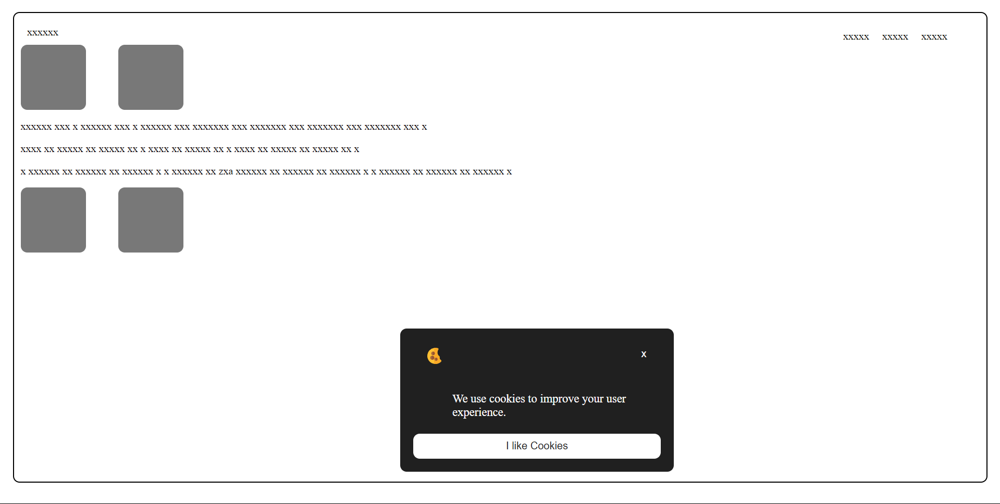

Cookie Consent

web link - https://abh7n.github.io/cookie-consent/

A simple JavaScript library for displaying cookie consent banners.

Features

- Displays customizable cookie consent banner
- Sets cookie to track user consent
- Hides banner after user acceptance or decline
- GDPR and CCPA compliant

Installation

Using npm

bash
npm install cookie-consent

Using CDN

Usage

HTML

  
This website uses cookies to improve your experience.

  <button class="accept-cookies" id="accept-cookies">Accept</button>
  <button class="decline-cookies" id="decline-cookies">Decline</button>
  <a href="#" class="cookie-policy">Cookie Policy</a>

JavaScript

const cookieConsent = new CookieConsent({
  container: '#cookie-consent',
  acceptButton: '#accept-cookies',
  declineButton: '#decline-cookies',
  cookieName: 'cookieConsent',
  expirationDays: 30
});

Options

- container: Selector for cookie consent container
- acceptButton: Selector for accept button
- declineButton: Selector for decline button
- cookieName: Name of cookie to set
- expirationDays: Number of days until cookie expires

Methods

- init(): Initializes cookie consent banner
- destroy(): Destroys cookie consent banner

Events

- accept: Fired when user accepts cookies
- decline: Fired when user declines cookies

Browser Support

- Chrome
- Firefox
- Safari
- Edge

License

MIT License

Contributing

Contributions are welcome! Please submit a pull request.

Authors

- (link unavailable)

Version

1.0.0
